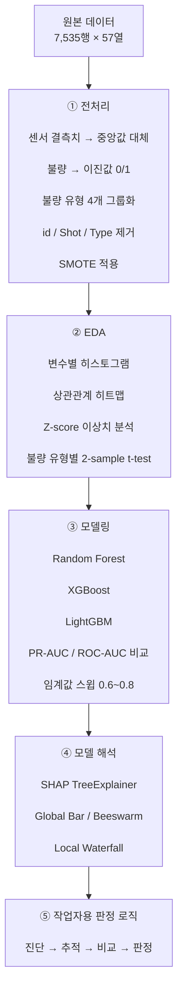

# 다이캐스팅 공정 불량 예측 및 의사결정 지원


공정·센서 데이터를 활용해 **다이캐스팅 제조 공정의 불량 가능성을 예측**하고, 주요 기여 변수를 분석해 **작업자용 4단계 판정 리포트**로 연결한 머신러닝 프로젝트입니다.

Random Forest, XGBoost, LightGBM을 비교하고, 클래스 불균형과 임계값을 함께 고려해 최종 모델을 선정했습니다. 단순 예측 성능에 그치지 않고 **FN/FP 비용 차이, SHAP 기반 설명 가능성, 현장 활용을 고려한 판정 로직**까지 연결하는 데 초점을 맞췄습니다.

> **Team 일오나!! — 내일배움캠프 데이터 분석 부트캠프 심화 프로젝트, 15조**
> 팀 프로젝트이며, 제가 직접 수행한 범위는 아래 **개인 기여** 섹션에 별도로 구분했습니다.

---

## 1. 프로젝트 요약

| 항목         | 내용                                                              |
| ---------- | --------------------------------------------------------------- |
| **문제**     | 생산 이후 수동 육안검사에 의존하는 방식은 검사 속도와 판정 일관성에 한계가 있음                   |
| **목표**     | 공정·센서 데이터만으로 불량 가능성을 예측하고 주요 원인 후보 변수를 함께 제공                    |
| **모델**     | Random Forest / XGBoost / LightGBM                              |
| **불균형 대응** | SMOTE                                                           |
| **평가 기준**  | PR-AUC, ROC-AUC, F1, Precision, Recall, FP/FN                   |
| **최종 모델**  | **LightGBM**                                                    |
| **최종 임계값** | **0.68**                                                        |
| **해석 가능성** | SHAP TreeExplainer                                              |
| **운영 연결**  | 진단 → 주요 변수 확인 → 정상군 비교 → 위험 판정                                  |
| **기술 스택**  | Python, scikit-learn, XGBoost, LightGBM, SHAP, imbalanced-learn |

### 핵심 결과

* LightGBM 기준 주요 3개 불량 그룹에서 **F1 0.78~0.80**
* 충전불량 Precision **0.9888**
* 기포/내부 F1 **0.8000**
* 표면손상 F1 **0.7816**
* FN/FP 단위 비용을 반영한 가정 기반 시뮬레이션에서 **10일당 약 350만원 비용 절감 가능성 추정**
* 수동검사 가정 대비 **약 100배 처리 속도 개선 가능성 추정**

> 비용 절감, 처리 속도, 검출률 개선 수치는 실제 생산 현장에서 측정된 값이 아니라 **가정 기반 시뮬레이션 결과**입니다.

---

## 2. 문제 정의

다이캐스팅 공정에서는 생산 이후 사람이 직접 제품을 확인하는 육안검사가 사용될 수 있습니다.

이 방식은 직관적이지만 다음과 같은 한계가 있습니다.

| 구분         | 기존 검사 방식            | ML 기반 접근                   |
| ---------- | ------------------- | -------------------------- |
| **검사 방법**  | 주조 후 수동 육안검사        | 공정·센서 데이터 기반 예측            |
| **검사 시점**  | 생산 후                | 생산 중 데이터 활용 가능             |
| **판정 일관성** | 작업자·상황에 따라 편차 발생 가능 | 동일 모델 기준으로 반복 판정           |
| **불량 범위**  | 육안 확인 가능한 표면 불량 중심  | 내부 불량 포함 복수 유형 예측 가능       |
| **속도**     | 수동 검사 기준 분당 약 1개    | 분석상 약 100배 처리 속도 개선 가능성 추정 |

본 프로젝트에서는 모델이 단순히 **불량 여부만 예측하는 것**이 아니라,

1. 불량 가능성을 계산하고
2. 어떤 변수가 판단에 크게 영향을 주었는지 보여주고
3. 정상 제품의 기준값과 비교한 뒤
4. 작업자가 확인할 수 있는 위험 정보를 제공하는 것

까지 연결하는 것을 목표로 했습니다.

---

## 3. 데이터셋

| 항목     | 값                                            |
| ------ | -------------------------------------------- |
| **출처** | 주조 품질보증 AI 데이터셋 — KAMP                       |
| **연도** | 2022                                         |
| **파일** | `DieCasting_Quality_Raw_Data.csv`            |
| **규모** | 7,535행 × 57열                                 |
| **구조** | MultiIndex: `Process` / `Sensor` / `Defects` |

### 공정 변수

| 분류     | 주요 피처                                                               |
| ------ | ------------------------------------------------------------------- |
| **속도** | `Velocity_1`, `Velocity_2`, `Velocity_3`, `High_Velocity`           |
| **시간** | `Spray_Time`, `Rapid_Rise_Time`, `Pressure_Rise_Time`, `Cycle_Time` |
| **압력** | `Cylinder_Pressure`, `Casting_Pressure`                             |
| **힘**  | `Clamping_Force`                                                    |
| **기타** | `Biscuit_Thickness`                                                 |

### 센서 변수

| 분류     | 주요 피처                                                  |
| ------ | ------------------------------------------------------ |
| **온도** | `Factory_Temp`, `Coolant_Temp`, `Melting_Furnace_Temp` |
| **습도** | `Factory_Humidity`                                     |
| **압력** | `Coolant_Pressure`, `Air_Pressure`                     |

### 불량 그룹

기존 불량 유형을 모델링 편의를 위해 4개 그룹으로 재구성했습니다.

| 그룹        | 포함 불량                                                   |
| --------- | ------------------------------------------------------- |
| **충전불량**  | Short Shot                                              |
| **기포/내부** | Bubble, Blow Hole                                       |
| **표면손상**  | Dent, Scratch, Stain, Burning Mark, Exfoliation         |
| **기타**    | Crack, Deformation, Impurity, Contamination, Inclusions |

---

## 4. 분석 및 모델링 흐름



---

## 5. 데이터 전처리

### 결측치 처리

센서 변수의 결측치는 **중앙값으로 대체**했습니다.

평균 대신 중앙값을 사용해 일부 극단값이 결측치 대체값에 미치는 영향을 줄이고자 했습니다.

### 불량 이진화 및 그룹화

각 불량 유형을 `0 / 1`로 변환한 뒤 의미가 유사한 유형을 다음 4개 그룹으로 묶었습니다.

* 충전불량
* 기포/내부
* 표면손상
* 기타

### 불필요 변수 제거

모델 학습에 직접적인 의미가 낮은 식별 목적의 변수는 제거했습니다.

* `id`
* `Shot`
* `Type`

### 클래스 불균형 대응

일부 불량 그룹은 정상 데이터 대비 불량 데이터의 비율이 매우 낮았습니다.

따라서 학습 데이터에 **SMOTE**를 적용해 소수 클래스의 학습 기회를 보완했습니다.

---

## 6. 탐색적 데이터 분석

EDA에서는 다음 항목을 확인했습니다.

### 6.1 변수별 분포

공정 및 센서 변수의 히스토그램을 통해 분포 형태와 이상값 존재 여부를 확인했습니다.

### 6.2 상관관계

공정 변수와 센서 변수 간 상관관계를 히트맵으로 확인했습니다.

### 6.3 이상치

Z-score를 활용해 극단값을 탐색했습니다.

### 6.4 불량군과 정상군 비교

각 불량 유형에 대해 주요 변수의 평균 차이가 존재하는지 확인하기 위해 **독립표본 2-sample t-test**를 수행했습니다.

EDA 결과는 이후 모델 학습과 SHAP 기반 변수 해석을 위한 참고 자료로 활용했습니다.

---

## 7. 모델 비교

다음 세 가지 트리 기반 모델을 비교했습니다.

* Random Forest
* XGBoost
* LightGBM

클래스 불균형이 있는 문제이므로 Accuracy만으로 모델을 평가하지 않고 다음 지표를 함께 확인했습니다.

* PR-AUC
* ROC-AUC
* Precision
* Recall
* F1 Score
* False Positive
* False Negative

### 임계값 조정

기본 임계값 `0.5`만 사용하지 않고 **0.6~0.8 구간을 스윕**해 불량 탐지와 오탐 간 균형을 비교했습니다.

최종 임계값은:

> **0.68**

로 선정했습니다.

---

## 8. 모델 성능

### 모델 비교 — Threshold = 0.68

| 불량 그룹     | Random Forest |   XGBoost | **LightGBM** |
| --------- | ------------: | --------: | -----------: |
| 충전불량 F1   |         0.588 |     0.664 |    **0.789** |
| 기포/내부 F1  |         0.545 |     0.695 |    **0.800** |
| 표면손상 F1   |         0.591 |     0.719 |    **0.782** |
| 기타 F1     |         0.200 | **0.269** |        0.264 |
| **평균 F1** |         ~0.48 |     ~0.59 |    **~0.66** |

주요 3개 불량 그룹에서는 LightGBM이 가장 높은 F1을 기록했습니다.

`기타` 그룹에서는 XGBoost의 F1이 LightGBM보다 소폭 높았지만, 전체 불량 그룹의 PR-AUC와 FP, 주요 그룹의 탐지 성능을 종합적으로 고려해 **LightGBM을 최종 모델로 선정**했습니다.

### LightGBM 최종 성능

| 불량 그룹 | Accuracy | Precision | Recall |         F1 | FP | FN |
| ----- | -------: | --------: | -----: | ---------: | -: | -: |
| 충전불량  |   0.9688 |    0.9888 | 0.6567 | **0.7892** |  1 | 46 |
| 기포/내부 |   0.9794 |    0.9254 | 0.7045 | **0.8000** |  5 | 26 |
| 표면손상  |   0.9748 |    0.9189 | 0.6800 | **0.7816** |  6 | 32 |
| 기타    |   0.9741 |    0.4667 | 0.1842 |     0.2642 |  8 | 31 |

### LightGBM 선정 이유

최종 모델은 단순 Accuracy 기준이 아니라 다음 요소를 종합해 선정했습니다.

1. 클래스 불균형 환경에서의 **PR-AUC**
2. 주요 불량 그룹의 **F1 및 Recall**
3. 불필요한 검사 증가로 이어질 수 있는 **False Positive**
4. 놓친 불량으로 이어지는 **False Negative**
5. 실제 운영에서 사용할 수 있는 임계값 조정 가능성

---

## 9. SHAP 기반 모델 해석

트리 모델의 예측 결과를 설명하기 위해 **SHAP TreeExplainer**를 사용했습니다.

> SHAP 글로벌/로컬 시각화 및 변수 기여도 분석은 팀원이 담당했으며, 저는 해당 결과를 작업자용 판정 로직과 연결하는 부분을 담당했습니다.

### 분석 방식

* Global SHAP Bar Plot
* SHAP Beeswarm
* Local Waterfall Plot

### 충전불량 주요 기여 변수

| 순위 | 변수                             | 분석상 방향성            |
| -- | ------------------------------ | ------------------ |
| 1  | `Process\|High_Velocity`       | 값 증가 시 불량 위험 증가 경향 |
| 2  | `Process\|Clamping_Force`      | 값 증가 시 불량 위험 증가 경향 |
| 3  | `Sensor\|Melting_Furnace_Temp` | 값 증가 시 불량 위험 증가 경향 |
| 4  | `Process\|Spray_2_Time`        | 값 증가 시 불량 위험 증가 경향 |
| 5  | `Process\|Casting_Pressure`    | 관측 조건에 따라 영향 방향 상이 |

SHAP 값은 변수와 불량 간 인과관계를 의미하지 않습니다.

따라서 본 프로젝트에서는 해당 결과를 **불량의 원인을 확정하는 용도**가 아니라, 작업자가 우선 확인할 **원인 후보 변수**를 제시하는 방식으로 활용했습니다.

---

## 10. 작업자용 4단계 판정 로직

모델 결과를 현장에서 활용하기 쉽게 다음 4단계로 구성했습니다.

### ① 진단

모델이 계산한 불량 발생 확률을 제공합니다.

### ② 추적

SHAP 기준으로 해당 예측에 영향을 많이 준 변수 Top-N을 추출합니다.

### ③ 비교

각 변수의 현재값을 정상 제품군의 중앙값과 비교합니다.

### ④ 판정

정상군 기준 대비 편차가 일정 수준을 초과하는 경우 위험 신호를 제공합니다.

```text
==========================================================
  [① 진단] 그룹: 충전불량 | 샘플 #0

  불량 발생 확률: 72.4%
  판정: 불량
  실제: 불량


  [② 추적 → ③ 비교 → ④ 판정]

  순위   변수                       기준값    현재값    편차      판정
  ------------------------------------------------------------------
  1     High Velocity              0.191     0.215    +12.6%    ⚠ 위험
  2     Clamping Force           379.000   410.000     +8.2%    ✔ 안전
  3     Melting Furnace Temp     650.000   698.000     +7.4%    ✔ 안전
  4     Spray 2 Time              12.200    15.800    +29.5%    ⚠ 위험
  5     Casting Pressure         596.000   641.000     +7.6%    ✔ 안전

  기준: 정상군 중앙값
  편차: (현재값 - 기준값) / 기준값 × 100
  |편차| > 10% → 위험
==========================================================
```

이 구조는 모델의 예측값만 보여주는 대신,

> **“왜 위험하다고 판단했는가?”**

를 작업자가 추가로 확인할 수 있도록 설계했습니다.

---

## 11. 비용 기반 의사결정 시뮬레이션

모델 성능만으로는 실제 운영 가치를 설명하기 어렵다고 판단해 FP와 FN에 서로 다른 비용을 적용했습니다.

### 비용 가정

| 항목                |       단위 비용 |
| ----------------- | ----------: |
| **FN — 놓친 불량**    |  ₩3,000 / 건 |
| **FP — 정상 제품 오탐** | ₩20,000 / 건 |

이를 기반으로 기존 검사 방식과 ML 기반 검사 방식을 비교했습니다.

### 시뮬레이션 결과

| 지표     |                 추정 결과 |
| ------ | --------------------: |
| 비용 절감  | **10일당 약 ₩3,503,430** |
| 처리 속도  |     **약 100배 개선 가능성** |
| 불량 검출률 |     수동 대비 **약 +15%p** |
| 작업 시간  |      **약 50% 단축 가능성** |

> **주의**
> 위 결과는 FN/FP 단위 비용과 수동검사 성능에 대한 가정을 기반으로 계산한 시뮬레이션입니다. 실제 생산 라인에서 측정된 절감액이나 검사 성능을 의미하지 않습니다.

실무 적용 전에는 실제 수동검사 성능, 검사 인건비, 불량 폐기 비용, 재검사 비용 등을 확보해 베이스라인을 다시 계산해야 합니다.

---

## 12. 개인 기여

본 프로젝트는 팀 프로젝트이며, 아래 항목은 제가 직접 수행한 범위입니다.

### 데이터 전처리

* 센서 결측치 중앙값 대체
* 이상치 처리
* 불량 변수 이진화
* 불량 유형 4개 그룹 매핑
* SMOTE 적용

### 모델링

* Random Forest / XGBoost / LightGBM 비교
* PR-AUC 기반 모델 비교
* 임계값 스윕
* 최종 임계값 `0.68` 선정

### 작업자용 판정 로직

* 불량 확률 출력
* 주요 기여 변수 Top-N 추출 결과 연결
* 정상군 중앙값 비교
* 위험 / 안전 판정 로직 구현

### 비용 시뮬레이션

* FN / FP 단위 비용 가정
* 오류 유형별 비용 계산
* 10일 기준 비용 절감 가능성 추정

### 팀원 담당

다음 영역은 팀원이 담당했습니다.

* SHAP Global Bar Plot
* SHAP Beeswarm
* SHAP Local Waterfall
* SHAP 기반 주요 변수 분석

저는 해당 결과를 활용해 **작업자용 판정 로직으로 연결하는 부분**을 담당했습니다.

---

## 13. 프로젝트 구조

```text
Real-Time-Defect-Prediction-for-Die-Casting-Manufacturing/
│
├── 다이캐스팅_불량예측.ipynb
├── DieCasting_Quality_Raw_Data.csv
├── 다이캐스팅 프로젝트.pdf
└── README.md
```

---

## 14. 노트북 구성

| 섹션              | 설명                                                  |
| --------------- | --------------------------------------------------- |
| **0. Setup**    | 라이브러리, OS별 한글 폰트 자동 감지, 전역 상수                       |
| **1. 데이터 로드**   | MultiIndex CSV 로딩, 결측 확인, 컬럼 그룹화                    |
| **2. EDA**      | 히스토그램, 상관관계, Z-score 이상치, 불량 유형별 t-test             |
| **3. 전처리**      | 중앙값 대체, 불량 이진화, 그룹 매핑, SMOTE                        |
| **4. 모델링**      | RF / XGB / LGBM, PR/ROC 비교, 임계값 스윕, 혼동행렬, 5-fold CV |
| **5. SHAP**     | Global / Local SHAP 분석 *(팀원 담당)*                    |
| **6. 판정 로직**    | 불량 확률 → 주요 변수 → 정상군 비교 → 위험 판정                      |
| **7. 비용 시뮬레이션** | FN/FP 비용, 누적 비용, 수동검사 대비 비교                         |

---

## 15. 한계 및 향후 과제

### 1. 실제 ROI 검증

현재 비용 절감과 처리 속도는 가정 기반 시뮬레이션입니다.

실제 제조 현장의 다음 데이터가 필요합니다.

* 육안검사 정확도
* 검사 시간
* 검사 인건비
* 불량 폐기 비용
* 재검사 비용

이를 확보하면 실제 ROI를 다시 계산할 수 있습니다.

### 2. 다중공선성 점검

공정 데이터는 일부 변수 간 상관관계가 높을 수 있습니다.

향후에는 다음 방법을 활용할 수 있습니다.

* VIF
* 상관관계 기반 피처 제거
* 중복 정보가 높은 변수 정리

### 3. 하이퍼파라미터 튜닝

현재 모델보다 체계적인 최적화를 위해 향후 **Optuna 기반 Bayesian Optimization**을 적용할 수 있습니다.

### 4. 피처 엔지니어링

다음과 같은 공정 변수 간 상호작용도 검토할 수 있습니다.

* Velocity × Pressure
* Temperature × Cycle Time
* 공정별 Rolling Statistics

### 5. 모델 운영 관리

실제 배포 환경에서는 다음 기능이 필요합니다.

* MLflow Experiment Tracking
* Model Registry
* 모델 버전 관리
* 데이터 및 성능 Drift 모니터링

### 6. 실시간 모니터링

향후 Streamlit 또는 Grafana를 활용해 다음 정보를 실시간으로 제공하는 대시보드로 확장할 수 있습니다.

* 불량 발생 확률
* 불량 그룹
* 주요 기여 변수
* 정상군 대비 편차
* 위험 공정 변수

---

## 16. 프로젝트에서 고민한 점

이 프로젝트에서 가장 중요하게 본 것은 **가장 높은 Accuracy를 만드는 것**이 아니었습니다.

제조 불량 예측에서는 정상 데이터가 많기 때문에 Accuracy가 높아도 실제 불량을 놓칠 수 있습니다. 따라서 PR-AUC와 Recall, F1을 함께 확인하고, FP와 FN이 운영 비용에 서로 다른 영향을 준다는 점까지 반영했습니다.

또한 모델이 높은 확률을 출력하는 것만으로는 현장 활용성이 부족하다고 판단했습니다.

그래서 모델 예측을

> **불량 확률 → 주요 기여 변수 → 정상 제품 기준 비교 → 위험 판정**

으로 연결해 사람이 다음 행동을 판단할 수 있는 형태로 정리했습니다.

향후 실제 제조 현장의 검사 비용과 품질 데이터를 확보한다면, 모델 성능뿐 아니라 **운영 비용과 품질 개선 효과까지 함께 최적화하는 의사결정 시스템**으로 발전시키는 것이 목표입니다.

---

## 17. 참고문헌

* Ministry of SMEs and Startups & KAIST. (2022). *Casting Quality Assurance AI Dataset*. KAMP.
* Uyan, T.Ç., et al. (2023). *Industry 4.0 Foundry Data Management and Supervised Machine Learning in Low-Pressure Die Casting Quality Improvement*. InterMetalcast, 17, 414–429.
* Pechmann, A. & Kanli, S. (2025). *Towards Sustainable Manufacturing: Deployable Deep Learning for Automated Defect Detection in Aluminum Die-Cast X-Ray Inspection*. Applied Sciences, 15, 13134.
* Okuniewska, A., Perzyk, M., & Kozłowski, J. (2023). *Machine Learning Methods for Diagnosing the Causes of Die-Casting Defects*. Computer Methods in Materials Science, 23(2), 45–56.
